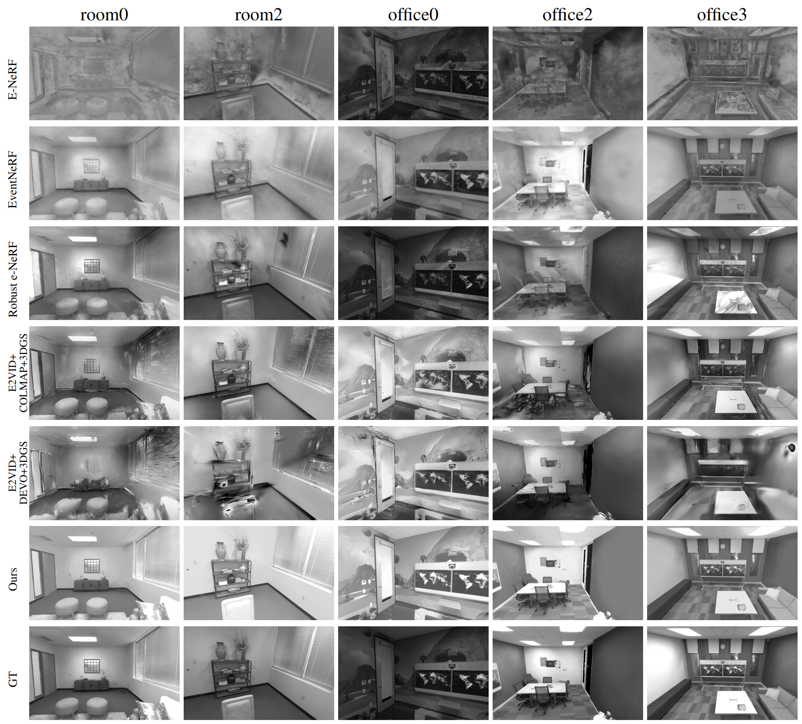
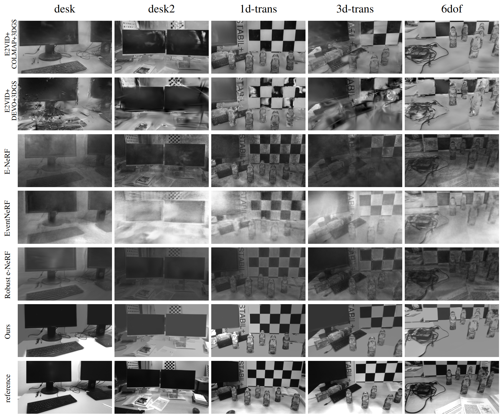
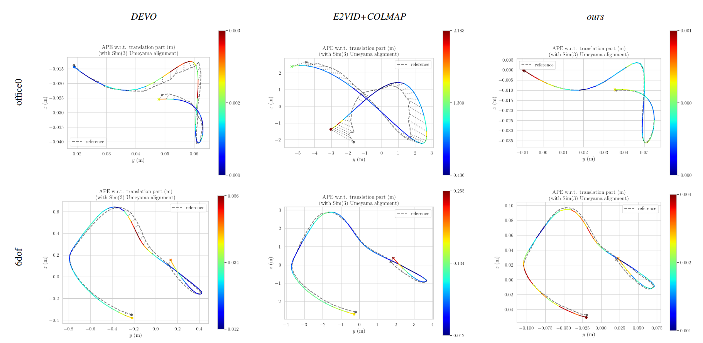

<h1 align="center">IncEventGS: Pose-Free Gaussian Splatting from a Single Event Camera</h1>
<p align="center">
    <a href="https://github.com/HuangJianxjtu">Jian Huang</a><sup>1,2</sup> &emsp;&emsp;
    <a href="https://github.com/forgetable233">Chengrui Dong</a><sup>1,2</sup> &emsp;&emsp;
    <a href="https://github.com/mian-zhi">Xuanhua Chen</a><sup>2,3</sup> &emsp;&emsp;
    <a href="https://ethliup.github.io/">Peidong Liu</a><sup>2*</sup>
</p>


<p align="center">
  <sup>*</sup> denotes corresponding author.
</p>

<p align="center">
    <sup>1</sup>Zhejiang University &emsp;&emsp;
    <sup>2</sup>Westlake University &emsp;&emsp;
    <sup>3</sup>Northeastern University &emsp;&emsp;
</p>

<hr>


<h5 align="center"> If you like our project, please give us a star ⭐ on GitHub.</h5>

<h5 align="center">

[](https://arxiv.org/abs/2410.08107)
</h5>

> This repository is the official implementation of the paper "IncEventGS: Pose-Free Gaussian Splatting from a Single Event Camera".


## 📢 News
<!-- &#9744; The code and data will be made public once the paper is accepted. Stay tuned! -->

`2025.04.04` 🔥Our paper has been selected as **CVPR 2025 Highlight**!

`2025.03.03` 🔥Our paper has been accepted by CVPR 2025!

`2024.10.11` Our paper is available on [arXiv](https://arxiv.org/abs/2410.08107).

## 📋 Overview

<p align="center">
    
</p>

<div>
IncEventGS processes incoming event stream by dividing it
into chunks and representing the camera trajectory as a continuous model. It randomly samples two
close consecutive timestamps to integrate the corresponding event streams. Two brightness images
are rendered from 3D Gaussian distributions at the corresponding poses, and we minimize the log
difference between the rendered images and the accumulated event images. During initialization, a
pre-trained depth estimation model estimates depth from the rendered images to bootstrap the system.
</div>

## 📋 Qualitative evaluation of novel view image synthesis on synthetic dataset.

<p align="center">
    
</p>

## 📋 Qualitative evaluation of novel view image synthesis on real dataset. 

<p align="center">
    
</p>

## 📋 Representative trajectory comparison

<p align="center">
    
</p>

## QuickStart
### 1. Installation
In the path where your want to store code, enter the following terminal command:

```bash
conda create -n iegs python=3.10
conda activate iegs
conda install -c "nvidia/label/cuda-11.8.0" cuda-toolkit # install CUDA toolkit
# Install the pytorch first (Please check the cuda version)
conda install pytorch torchvision torchaudio pytorch-cuda=11.8 -c pytorch -c nvidia

pip install -r requirements.txt

pip install ninja git+https://github.com/NVlabs/tiny-cuda-nn/#subdirectory=bindings/torch

pip install h5py hdf5plugin scikit-learn jaxtyping kornia

pip install -U  "huggingface-hub<0.26.0"
pip install pytorch_msssim
pip install tyro
pip install diffusers==0.27.1
pip install accelerate
pip install -U "transformers<=4.48.1"
```

### 2. Download Weights and Datasets
You can download pretrained weight of Marigold and datasets (Replica, pre-processed TUMVIE) by clicking this [link](https://westlakeu-my.sharepoint.com/:f:/g/personal/cvgl_westlake_edu_cn/EooEsF6LJPJHnEqbTYo4qO0B4-dlbznGZlLy9BDLPAx_og?e=wmqeFP). 

```bash
# unzip files
tar -xvf xxx.tar
```


### 3. Running demo
Before that, need to modify the `depthEst_pretrained_model_path` and `data:datadir`
```bash
python main.py --config configs/SimuEvent/replica_room0.yaml
```

### 4. Metrics Calculation

- NVS Performance
```bash
cd metrics/event_nerf
sh auto_single.sh [PATH_TO_IMG_EVAL] est gt 
```

- Pose Accuracy

    - install evo, `pip install evo`
    - run:
    ```bash
    cd [PATH_TO_EXPERIMENT]/global_BA
    evo_ape kitti [EST_PATH_NAME] [GT_PATH_NAME] --align -as
    ```

### 5. Dataset Format

**Our Replica(event) dataset** format is described as follows. It is recommended that you organize your custom datasets in this format if you want to run our method on **your own datasets**.

```
<dataset_name>              # e.g. room0
├── poses_ts.txt
├── traj.txt
├── images
    ├── frame000100.jpg   
    ├── frame000150.jpg
    ├── frame000200.jpg
    ...
├── event_threshold_0.1
    ├── gray_events_data.npy
```

- traj.txt format
```
r11 r12 r13 r14 r21 r22 r23 r24 r31 r32 r33 r34 r41 r42 r43 r44
```
r is transformation matrix (4*4).

## Citation

If you find this repository useful, please consider citing our paper:
```bibtex
@inproceedings{huang2025inceventgs,
    author = {Huang, Jian and Dong, Chengrui and Chen, Xuanhua and Liu, Peidong},
    title = {IncEventGS: Pose-Free Gaussian Splatting from a Single Event Camera},
    booktitle = {Proceedings of the IEEE/CVF Conference on Computer Vision and Pattern Recognition},
    year = {2025}
}
```

## Acknowledgments

This project is developed with several fantastic repos: [gsplat](https://github.com/nerfstudio-project/gsplat), [Co-SLAM](https://github.com/HengyiWang/Co-SLAM), [E-NeRF](https://github.com/knelk/enerf), [EventNeRF](https://github.com/r00tman/EventNeRF), [BAD-Gaussians](https://github.com/WU-CVGL/BAD-Gaussians), [Marigold](https://github.com/prs-eth/Marigold), [Diffusers](https://github.com/huggingface/diffusers) and [PyPose](https://github.com/pypose/pypose). We appreciate the effort of the contributors to these amazing repositories.